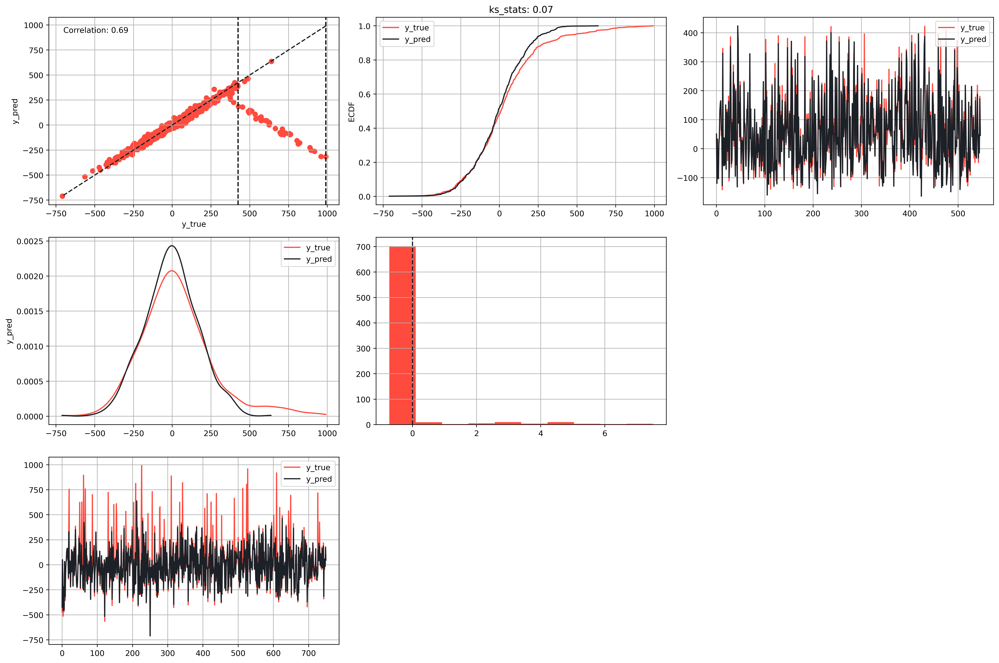

# MLPR Library



This repository is a developing library named `MLPR` (Machine Learning Pipeline Report). It aims to facilitate the creation of machine learning models in various areas such as regression, forecasting, classification, and clustering. The library allows the user to perform tuning of these models, generate various types of plots for post-modeling analysis, and calculate various metrics.

In addition, `MLPR` allows the creation of metric reports using [`Jinja2`](https://pypi.org/project/Jinja2/), including the obtained graphs. The user can customize the report template according to their needs.

# Using the MLPR Library
The MLPR library is a powerful tool for machine learning and data analysis. Here's a brief guide on how to use it.

## Installation
Before you start, make sure you have installed the MLPR library. You can do this by running pip install mlpr.


```bash
pip install mlpr
```
# Regression

How to use the module for regression problems.
<details>


## Importing the Library
First, import the necessary modules from the library:

```python
from mlpr.ml.regression import metrics, plots
from mlpr.ml.tunning.grid_search import GridSearch
from mlpr.reports.reports import ReportGenerator
```

## Loading the Data
Load your dataset. In this example, we're using the diabetes dataset from sklearn:

```python
import sklearn.datasets as load_diabetes
content = load_diabetes()
data = pd.DataFrame(
    content["data"],
    columns=content["feature_names"]
)
data["target"] = content["target"]
```

## Set the seed
Set the random seed for reproducibility

```python
n_seed = 42
np.random.seed(n_seed)
```

## Preparing the Data
Split your data into features ($X$) and target ($y$):

```python
X = data.drop("target", axis=1)
y = data["target"].values
```
## Model Training
Define the parameters for your models and use `GridSearch` to find the best model:

```python
models_params = {
    Ridge: {
        'alpha': [0.1, 1.0, 10.0],
        'random_state': [n_seed]
    },
    Lasso: {
        'alpha': [0.1, 1.0, 10.0],
        'random_state': [n_seed]
    },
    SVR: {
        'C': [0.1, 1.0, 10.0],
        'kernel': ['linear', 'rbf']
    },
    RandomForestRegressor: {
        'n_estimators': [10, 50, 100],
        'max_depth': [None, 5, 10],
        'random_state': [n_seed]
    },
    GradientBoostingRegressor: {
        'n_estimators': [100, 200],
        'learning_rate': [0.1, 0.05, 0.01], 'random_state': [n_seed]
    },
    XGBRegressor: {
        'n_estimators': [100, 200],
        'learning_rate': [0.1, 0.05, 0.01], 'random_state': [n_seed]
    }
}

params_split = {
    'test_size': 0.25,
    'random_state': n_seed
}
params_norm = {
    'with_mean': True,
    'with_std': True
}

grid_search = GridSearch(
    X,
    y,
    params_split=params_split,
    models_params=models_params,
    normalize=True,
    params_norm=params_norm
)
grid_search.search()

best_model, best_params = \
    grid_search \
        .get_best_model()

```


## Making Predictions
Use the best model to make predictions:

```python
data_test["y_pred"] = \
    grid_search \
        .best_model \
            .predict(grid_search.X_train)
```

## Visualizing the Results
Plot the results using the `RegressionPlots` module:

```python
rp = \
    plots \
        .RegressionPlots(
            data_test,
            color_palette=["#FF4B3E", "#1C2127"]
        )
```

## Evaluating the Model
Calculate various metrics to evaluate the performance of the model:

```python
rm = metrics.RegressionMetrics(
    data_test,
    *["y_true", "y_pred"]
)
results = rm.calculate_metrics(
    ["mape", "rmse", "kolmogorov_smirnov", "confusion_matrix", "calculate_kappa"],
    {
        "mape": {},
        "rmse": {},
        "kolmogorov_smirnov": {},
        "confusion_matrix": {"n_bins": k},
        "calculate_kappa": {"n_bins": k}
    }
)
```

## Results

The output it's a dictionary object with the calculated metrics, like this:

```
{'mape': 39.594540526956436,
 'rmse': 54.09419440169204,
 'kolmogorov_smirnov': (0.1510574018126888, 0.0010310446878578096),
 'confusion_matrix': (array([[54, 57,  2,  0],
         [16, 70, 21,  0],
         [ 0, 37, 37,  3],
         [ 0,  6, 25,  3]]),
  {'precision': array([0.77142857, 0.41176471, 0.43529412, 0.5       ]),
   'recall': array([0.47787611, 0.65420561, 0.48051948, 0.08823529]),
   'f1_score': array([0.59016393, 0.50541516, 0.45679012, 0.15      ]),
   'support': array([113, 107,  77,  34]),
   'accuracy': 0.4954682779456193}),
 'calculate_kappa': {0: {'confusion_matrix': array([[202,  16],
          [ 59,  54]]),
   'kappa_score': 0.4452885840055415,
   'metrics': {'precision': array([0.77394636, 0.77142857]),
    'recall': array([0.9266055 , 0.47787611]),
    'f1_score': array([0.8434238 , 0.59016393]),
    'support': array([218, 113]),
    'accuracy': 0.7734138972809668}},
  1: {'confusion_matrix': array([[124, 100],
          [ 37,  70]]),
   'kappa_score': 0.180085703437178,
   'metrics': {'precision': array([0.77018634, 0.41176471]),
    'recall': array([0.55357143, 0.65420561]),
    'f1_score': array([0.64415584, 0.50541516]),
    'support': array([224, 107]),
    'accuracy': 0.5861027190332326}},
  2: {'confusion_matrix': array([[206,  48],
          [ 40,  37]]),
   'kappa_score': 0.2813579394059016,
   'metrics': {'precision': array([0.83739837, 0.43529412]),
    'recall': array([0.81102362, 0.48051948]),
    'f1_score': array([0.824     , 0.45679012]),
    'support': array([254,  77]),
    'accuracy': 0.7341389728096677}},
  3: {'confusion_matrix': array([[294,   3],
          [ 31,   3]]),
   'kappa_score': 0.12297381546134645,
   'metrics': {'precision': array([0.90461538, 0.5       ]),
    'recall': array([0.98989899, 0.08823529]),
    'f1_score': array([0.94533762, 0.15      ]),
    'support': array([297,  34]),
    'accuracy': 0.8972809667673716}}}}
```

## Reports

Here you can see the <a href="https://raw.githack.com/Manuelfjr/mlpr/develop/data/05_reports/report_model.html">report</a> output.

</details>

## Contact

Here you can find my contact information:

<div align="center">
    <a href="https://github.com/Manuelfjr/mlpr">
        
    </a>
</div>

<br>

<div align="center">

[](https://manuelfjr.github.io)
[](https://github.com/manuelfjr)
[](https://www.instagram.com/manuelferreirajr/)
[](https://www.linkedin.com/in/manuefjr/)
[](mailto:ferreira.jr.ufpb@gmail.com)

</div>

## License

This project is licensed under the terms of the MIT license. For more details, see the [LICENSE](/LICENSE) file in the project's root directory.